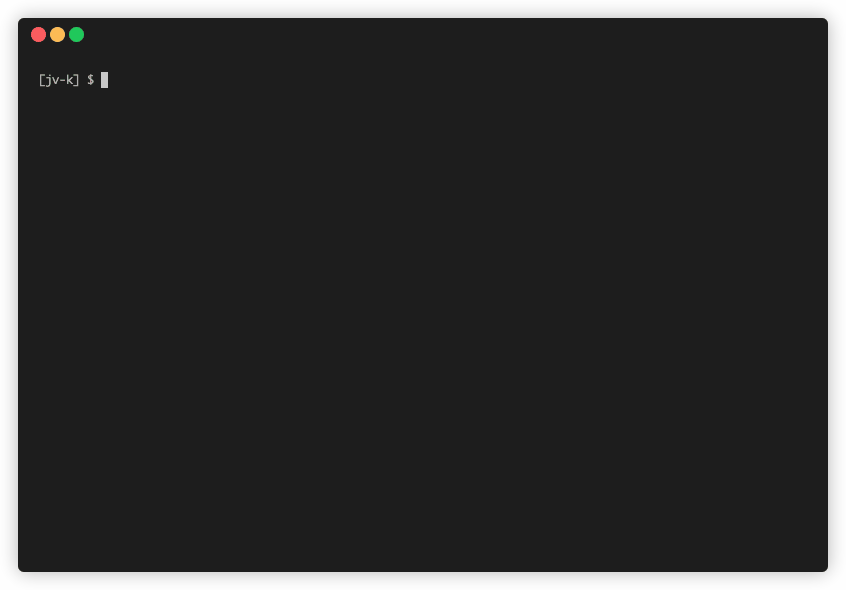

# ▶️👉🏻🗑 Delete Workflow Runs 



## Description

This npm module can be used to easily delete unneeded GitHub Workflow runs from your GitHub remote repository. You can select multiple entries to be deleted at once easily from a navigable list.

It uses the GitHub API, and requires gh (GitHub CLI) and jq (JSON processor)

## QuickStart

1. Install [GitHub CLI](https://github.com/cli/cli) and [jq](https://github.com/stedolan/jq), for example on `MacOS`:
    ```sh
    $ brew install gh jq
    ```

2. Install `delete-workflow-runs` globally:
    ```shh
    $ npm i -g delete-workflow-runs
    ```

3. Navigate to the directory of the repository that you wish to delete workflow runs from, then run:
    ```sh
    $ delete-workflow-runs
    ```
4. Use the `<up>` and `<down>` keys to navigate the list of workflow runs, and select the ones to be deleted with `<tab>`.

5. Press `<enter>` to delete the runs from your GitHub remote.


